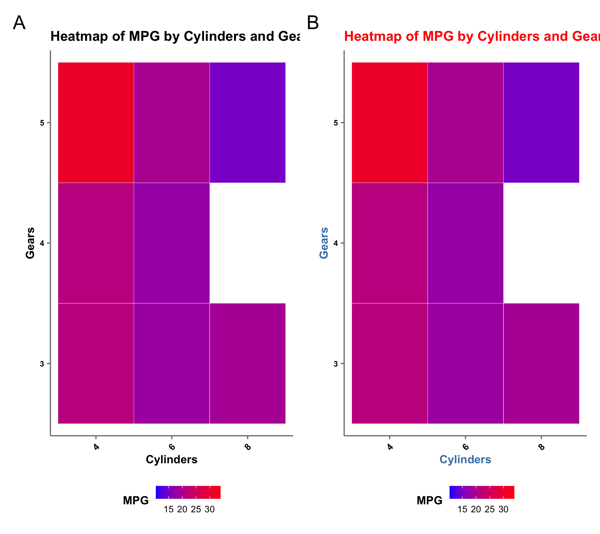

# ggplot Theme for MNB Lab

In scientific research, clear and effective data visualization is essential for interpreting results and communicating findings. However, inconsistent plot designs can lead to confusion and a lack of professionalism. To address these issues, implementing a theme function for `ggplot2` in the MNB Lab ensures standardized, efficient, and high-quality visual outputs.

### Key Points

1.  **Consistency Across Visualizations**: Ensures a uniform look and feel for all plots, enhancing brand identity, professionalism, and interpretability.

2.  **Efficiency and Productivity**: Saves time and reduces cognitive load by standardizing plot styles, allowing researchers to focus more on data analysis.

3.  **Improved Communication and Collaboration**: Facilitates better understanding and alignment among team members and collaborators through clear and consistent visualizations.

4.  **Enhanced Publication Quality**: Produces high-quality, consistent plots that comply with journal guidelines and enhance the impact of presentations and scientific posters.

5.  **Customizability and Flexibility**: Allows for a flexible yet standardized visual style that can be easily adapted and updated as the lab evolves.

``` r
# add this line to the begining of your r code. like loading libraries.
source("https://raw.githubusercontent.com/MNB-Lab/theme_MNB/main/theme.R")
```

``` r
ggplot(mtcars, aes(x = wt, y = mpg)) +
  geom_point() +
  labs(
    title = "Scatter plot of Weight vs. MPG",
    subtitle = "MNB Lab",
    x = "Weight (1000 lbs)",
    y = "Miles per Gallon"
  ) +
  fnTheme()
```

[](plots/mtcars_scatter.png)

## Parameters that can be passed to fnTheme()

there are several parameters you can pass to the fnTheme function

-   `legend.position`: 'bottom' (default), 'top', 'left' or 'right'

-   `x.text.angle` : default 0, numeric. when not 0

-   `vjustx` and `hjustx` : numeric, used for justifying the x axis text when `x.text.angle` is not 0

-   `baseTextSize`: default 8, numeric, a number that determines the base text size

    -   x and y axis text labels, legend.text size is set to `baseTextSize`

    -   legend title and axis title is set to `baseTextSize + 2`

    -   plot.title is `baseTextSize + 4`

    ``` r
    library(ggplot2)
    library(ggpubr)
    library(patchwork)

    # Load the mtcars dataset
    data(mtcars)

    # Create a basic scatter plot
    scatter_plot <- ggplot(mtcars, aes(x = wt, y = mpg)) +
      geom_point() +
      labs(title = "Scatter Plot of MPG vs Weight", x = "Weight (1000 lbs)", y = "Miles per Gallon") 

    # Apply the custom theme with default parameters
    scatter_plot_custom <- scatter_plot + fnTheme()

    # Apply the custom theme with legend position set to "right"
    scatter_plot_legend_right <- scatter_plot + fnTheme(legend.position = "right")

    # Apply the custom theme with increased text size and angled x-axis text
    scatter_plot_text_custom <- scatter_plot + fnTheme(baseTextSize = 12, x.text.angle = 45)

    # Apply the custom theme with custom vjust and hjust values
    scatter_plot_custom_just <- scatter_plot + fnTheme(baseTextSize = 10, x.text.angle = 60, vjustx = 0.5, hjustx = 0.5)

    print(scatter_plot_custom)
    print(scatter_plot_legend_right)
    print(scatter_plot_text_custom)
    print(scatter_plot_custom_just)

    plot_combined <- scatter_plot_custom + scatter_plot_legend_right +
      scatter_plot_text_custom + scatter_plot_custom_just +
      plot_layout(ncol = 2) &
      plot_annotation(tag_levels = 'A')

    print(plot_combined)
    ```

    

    ## addition edits to theme

You may also add additional edits to your theme after applying the base theme, giving more consistency in all your plots, but still with the flexibility of customisation.

``` r
# Heatmap using geom_tile with custom theme and colors
heatmap_plot <- ggplot(mtcars, aes(x = factor(cyl), y = factor(gear))) +
  geom_tile(aes(fill = mpg), color = "white") +
  scale_fill_gradient(low = "blue", high = "red") +
  labs(title = "Heatmap of MPG by Cylinders and Gears", x = "Cylinders", y = "Gears", fill = "MPG") +
  fnTheme(baseTextSize = 8, x.text.angle = 45, legend.key.size = 0.4 )

# for additional customisation
heatmap_plot_custom <- heatmap_plot + 
  theme(axis.title = element_text( color = "#4682B4"), # Steel blue color for axis titles
      plot.title = element_text(color = "red") # Red color for plot title
      )

combined_hm <- heatmap_plot + heatmap_plot_custom + 
  plot_layout(ncol = 2) &
    plot_annotation(tag_levels = "A")

print(combined_hm)
```


