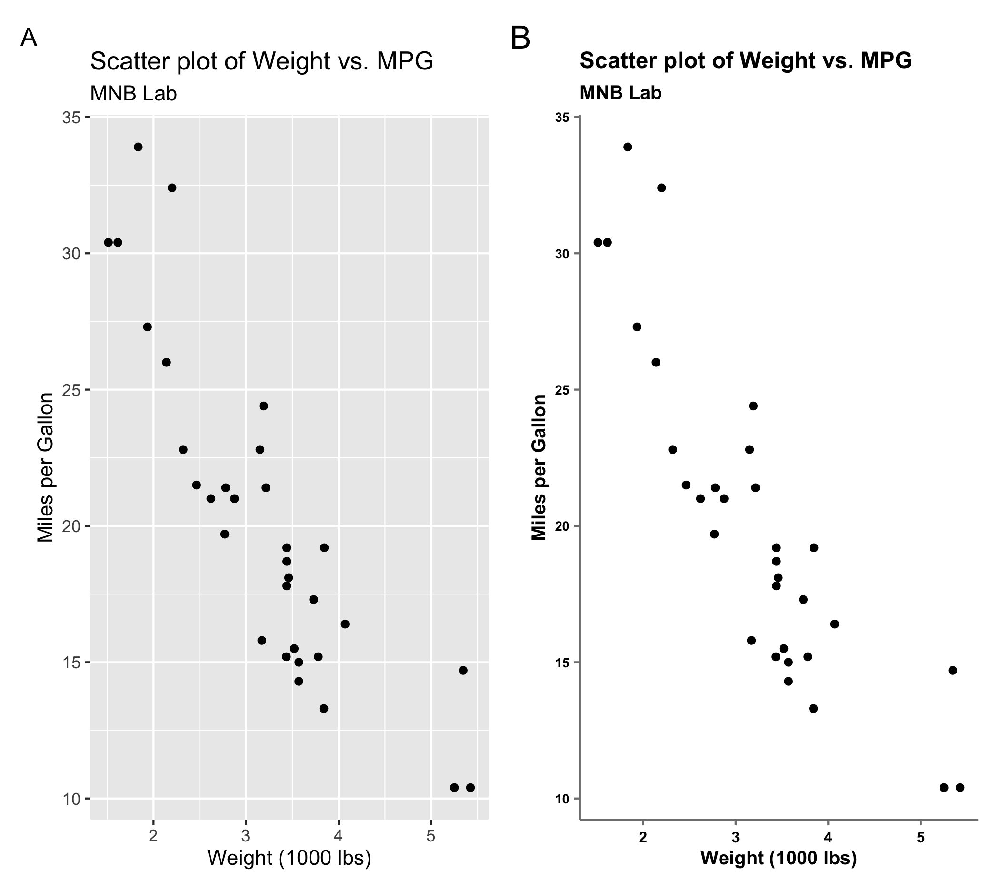

# ggplot Theme for MNB Lab

In scientific research, clear and effective data visualization is essential for interpreting results and communicating findings. However, inconsistent plot designs can lead to confusion and a lack of professionalism. To address these issues, implementing a theme function for `ggplot2` in the MNB Lab ensures standardized, efficient, and high-quality visual outputs.

### Key Points

1.  **Consistency Across Visualizations**: Ensures a uniform look and feel for all plots, enhancing brand identity, professionalism, and interpretability.

2.  **Efficiency and Productivity**: Saves time and reduces cognitive load by standardizing plot styles, allowing researchers to focus more on data analysis.

3.  **Improved Communication and Collaboration**: Facilitates better understanding and alignment among team members and collaborators through clear and consistent visualizations.

4.  **Enhanced Publication Quality**: Produces high-quality, consistent plots that comply with journal guidelines and enhance the impact of presentations and scientific posters.

5.  **Customizability and Flexibility**: Allows for a flexible yet standardized visual style that can be easily adapted and updated as the lab evolves.

``` r
# add this line to the begining of your r code. like loading libraries.
source("https://raw.githubusercontent.com/MNB-Lab/theme_MNB/main/theme.R")
```

``` r
ggplot(mtcars, aes(x = wt, y = mpg)) +
  geom_point() +
  labs(
    title = "Scatter plot of Weight vs. MPG",
    subtitle = "MNB Lab",
    x = "Weight (1000 lbs)",
    y = "Miles per Gallon"
  ) +
  fnTheme()
```

[](plots/mtcars_scatter.png)
